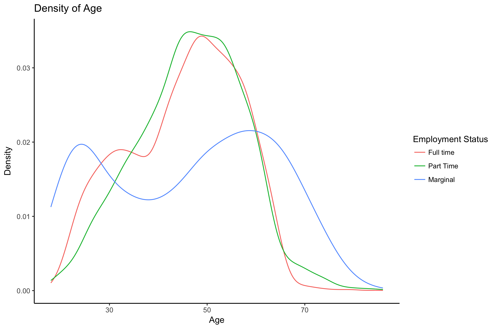
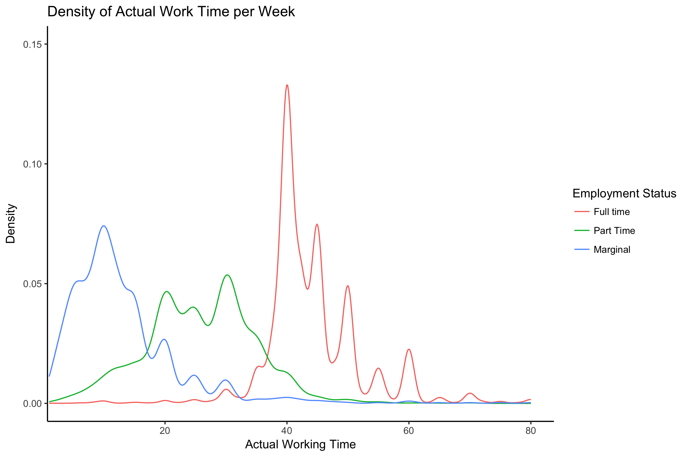

[](http://quantlet.de/)

## [](http://quantlet.de/) **SOEPQ2_DescriptiveAnalysis** [](http://quantlet.de/)

```yaml


```


### R Code:
```r
## Quantlet 2 - DescriptiveAnalysis Load Packages used in Q2
library(dplyr)
library(ggplot2)
library(stringr)
library(stargazer)
# Execution of Q1 is necessary beforehand!

# Descriptive Analysis of Data in 2013 Code can be applied for any year as it's created as functions
# Data Cleaning, Summary Statistics, Output

# Definition of data_selector Function to be able to select variables for a special wave
data_selector = function(input, wave) {
    select(filter(input, Wave == wave), c(Wave, never.Changing.Person.ID, State.of.Residence, Sex, Year.of.Birth,
        Registered.Unemployed, Employment.Status, Labor.Force.Status, Actual.Work.Time.Per.Week, Current.Gross.Labor.Income.in.Euro,
        School.Leaving.Degree, No.Vocational.Degree, Vocational.Degree.Received, College.Degree))
}

# Apply data_selector function to subset the dataset of 2013, using merged_all from Q1
sub2013 = data_selector(merged_all, 2013)

# Data Cleaning Function to check the table and levels of Labor Force Variable to sort out people not
# in working force anymore
check_labor_force = function(x) {
    view = c()
    view = c(view, table(x$Labor.Force.Status))
    view = c(view, levels(x$Labor.Force.Status))
    return(view)
}

# Apply check_labor_force for 2013 to find out the values, using the check_labor_force function
check_labor_force(sub2013)

# Function to change the values checked above
set_labor_force = function(x, y, z) {
    x$LaborForce_num = NA
    x$LaborForce_num = as.numeric(x$Labor.Force.Status)
    summary(x$LaborForce_num)
    # Just in case there would be missing values
    x$LaborForce_num[x$LaborForce_num <= y] = NA
    # Too old -> 4720 NA
    x$LaborForce_num[x$LaborForce_num == z] = NA
    return(x)
}

# Apply set_labor_force to the sub2013 Dataset
sub2013 = set_labor_force(sub2013, 6, 8)

# Function to calculate the actual age of the people, as there are only years in the dataset
age_calculator = function(x, year) {
    x$Age = year - x$Year.of.Birth
    # Implausible Value for Age
    x$Age[x$Age >= year] = NA
    return(x)
}

# Apply the age_calculator function to the 2013 subset
sub2013 = age_calculator(sub2013, 2013)

# Function to view the table and levels of genders
check_gender = function(x) {
    view = c()
    view = c(view, table(x$Sex))
    view = c(view, levels(x$Sex))
    return(view)
}

# Apply check_gender function on 2013
check_gender(sub2013)

# Function to correct Sex values
gender_correction = function(x) {
    # New column
    x$Sexnum = NA
    # Convert as numeric for analysis
    x$Sexnum = as.numeric(x$Sex) - 7
    # 0 = men, 1 = women Turn impausible values to NA
    x$Sexnum[x$Sexnum <= -1] = NA
    return(x)
}

# Apply gender_correction function on sub2013
sub2013 = gender_correction(sub2013)

# Function to return a table of the Registered Unemployed variable
check_unemployment = function(x) {
    return(table(x$Registered.Unemployed))
}

# Apply check_unemployment function on sub2013
check_unemployment(sub2013)

# Create a view for the Employment Status
check_employment_status = function(x) {
    view = c()
    view = c(view, "Employment Status Table: ")
    view = c(view, table(x$Employment.Status))
    view = c(view, "Employment Status Levels: ")
    view = c(view, levels(x$Employment.Status))
    return(view)
}

# Apply check_employment_status function on sub2013
check_employment_status(sub2013)

# Create function to remove individuals not affected by Minimum Wage
set_na_not_affected = function(x) {
    x$Employment.Status_num = NA
    x$Employment.Status_num = as.numeric(x$Employment.Status)
    x$Employment.Status_num[x$Employment.Status_num == 9] = NA
    x$Employment.Status_num[x$Employment.Status_num == 12] = NA
    x$Employment.Status_num[x$Employment.Status_num == 13] = NA
    x$Employment.Status_num[x$Employment.Status_num == 14] = NA
    x$Employment.Status_num[x$Employment.Status_num == 16] = NA
    x$Employment.Status_num[x$Employment.Status_num == 17] = NA
    x$Employment.Status_num[x$Employment.Status_num == 18] = NA
    return(x)
}

# Apply the set_na_not_affected function to the sub2013 subset
sub2013 = set_na_not_affected(sub2013)

# View over the Qualification High if college degree, middle if vocational degree, low if school
# degree, non if no school degree High = 3, Middle = 2, Low = 1, Non = 0 Create a function for it
check_qualification = function(x) {
    view = c()
    view = c(view, "SCHOOL LEAVING DEGREE")
    view = c(view, "School.Leaving.Degree Table:")
    view = c(view, table(x$School.Leaving.Degree))
    view = c(view, "School.Leaving.Degree Levels:")
    view = c(view, levels(x$School.Leaving.Degree))

    view = c(view, "NO VOCATIONAL DEGREE")
    view = c(view, "No.Vocational.Degree Table:")
    view = c(view, table(x$No.Vocational.Degree))
    view = c(view, "No.Vocational.Degree Levels:")
    view = c(view, levels(x$No.Vocational.Degree))

    view = c(view, "VOCATIONAL DEGREE")
    view = c(view, "Vocational.Degree.Received Table:")
    view = c(view, table(x$Vocational.Degree.Received))
    view = c(view, "Vocational.Degree.Received Levels:")
    view = c(view, levels(x$Vocational.Degree.Received))

    view = c(view, "COLLEGE DEGREE")
    view = c(view, "College.Degree Table:")
    view = c(view, table(x$College.Degree))
    view = c(view, "College.Degree Table (as numeric):")
    view = c(view, table(as.numeric(x$College.Degree)))
    view = c(view, "College.Degree Levels:")
    view = c(view, levels(x$College.Degree))
    return(view)
}

# Apply the check_qualification function to the sub2013 subset
check_qualification(sub2013)

# Change the values of the qualification variable to build groups
rearrange_qualification = function(x) {
    x$qualification = NA
    # School degree
    x$qualification[as.numeric(x$School.Leaving.Degree) == 12] = 0
    x$qualification[as.numeric(x$School.Leaving.Degree) == 13] = 0
    # No Vocational Degree
    x$qualification[as.numeric(x$No.Vocational.Degree) >= 7] = 1
    # Vocational Degree
    x$qualification[as.numeric(x$Vocational.Degree.Received) >= 7] = 2
    # College degree
    x$qualification[as.numeric(x$College.Degree) >= 7] = 3
    return(x)
}

# Apply the rearrange_qualification Function to sub 2013
sub2013 = rearrange_qualification(sub2013)

# Income Set Values of -2 to 0 -> People who have no Monthly Income Create a function for it
set_income = function(x) {
    x$Current.Gross.Labor.Income.in.Euro[(x$Current.Gross.Labor.Income.in.Euro) == -2] = 0
    return(x)
}

# Apply the set_income function to the 2013 dataset
sub2013 = set_income(sub2013)

# Working Time Set -3 to NA -> Implausible Answer Set -2 to 0 -> No working time Set -1 to NA -> Don't
# know working time Function to correct the working times
set_working_time = function(x) {
    x$Actual.Work.Time.Per.Week[(x$Actual.Work.Time.Per.Week) == -3] = NA
    x$Actual.Work.Time.Per.Week[(x$Actual.Work.Time.Per.Week) == -2] = 0
    x$Actual.Work.Time.Per.Week[(x$Actual.Work.Time.Per.Week) == -1] = NA
    return(x)
}

# Apply the set_working_time function to the 2013 dataset
sub2013 = set_working_time(sub2013)

# Create a function to drop all observations having at least 1 'NA', so only keep complete cases
drop_sub_na = function(x) {
    x[complete.cases(x), ]
}
# Apply the drop_sub_na function to a dataset
sub2013noNA = drop_sub_na(sub2013)

# Summary Statistics of Important Variables Variables of Interest: Sex, Age, Registered Unemployed,
# Employment Status, Qualification, Income, Working Time
filter_complete_cases = function(x) {
    x %>% select(State.of.Residence, qualification, Employment.Status, Registered.Unemployed, Employment.Status_num,
        Labor.Force.Status, LaborForce_num, Sexnum, Age, Actual.Work.Time.Per.Week, Current.Gross.Labor.Income.in.Euro)
}

# Apply filter_complete_cases Function to the 2013 dataset (without NAs)
sumsub2013 = filter_complete_cases(sub2013noNA)

# Function to calculate Hourly Earnings
calc_hourly_earnings = function(x) {
    x$Hourly.earnings = NA
    x$Hourly.earnings[x$Actual.Work.Time.Per.Week > 0] = x$Current.Gross.Labor.Income.in.Euro[x$Actual.Work.Time.Per.Week >
        0]/(4.3 * x$Actual.Work.Time.Per.Week[sumsub2013$Actual.Work.Time.Per.Week > 0])
    return(x)
}

# Apply calc_hourly_earnings Function to the 2013 dataset
sumsub2013 = calc_hourly_earnings(sumsub2013)

# Dummy for Affected by Minimum Wage 1 if hourly earnings < 8.50 Function to make it reusable
dummy_minimum_wage = function(x) {
    x$Subject.to.minwage = NA
    x$Subject.to.minwage[x$Hourly.earnings < 8.5] = 1
    x$Subject.to.minwage[is.na(x$Subject.to.minwage)] = 0
    return(x)
}

# Apply the dummy_minimum_wage function to sumsub2013
sumsub2013 = dummy_minimum_wage(sumsub2013)

# Function for Means Calculation of multiple variables
calc_means = function(x) {
    x %>% group_by(Employment.Status) %>% summarise(NumbOfObservations = n(), avg_Age = mean(Age, na.rm = TRUE),
        avg_Sex = mean(Sexnum, na.rm = TRUE), avg_Qualification = mean(qualification, na.rm = TRUE), avg_Hourly.earnings = mean(Hourly.earnings),
        avg_monthly.earnings = mean(Current.Gross.Labor.Income.in.Euro, na.rm = TRUE), avg_subject.minwage = mean(Subject.to.minwage))
}

# Apply the calc_means Function to the sumsub2013 dataset
Means2013 = calc_means(sumsub2013)

# Create output table with a function
print_means = function(x) {
    stargazer(t(x), title = "Descriptive statistics", type = "text", dep.var.labels = c("Employment Status",
        "Full Time", "Part Time", "Marginal", "Unemployed"), covariate.labels = c("n()", "mean age", "mean sex",
        "mean qualification", "mean hourly earning", "mean monthly earning"))
}

# Apply print_means to Means2013 dataset
print_means(Means2013)

# Show Kernel Density of the Variables in Means Output Plots Densityplot-Function for Age
plot_density_age = function(x) {
    ggplot(data = na.omit(x), aes(x = Age, group = Employment.Status, color = Employment.Status)) + geom_line(stat = "density") +
        theme_classic() + labs(title = "Density of Age", y = "Density", x = "Age") + scale_colour_hue(name = "Employment Status",
        labels = c("Full time", "Part Time", "Marginal", "Unemployed"))
}

# Plot plot_density_age with 2013 dataset
plot_density_age(sumsub2013)
```

```r
plot_output_density_age = plot_density_age(sumsub2013)
# Save the plot created above into a png-file
# ggsave('SOEPQ2_DescriptiveAnalysis/plots/plot_output_density_age.png', plot_output_density_age)

# Densityplot-Function for Hourly Earnings
plot_density_earnings = function(x) {
    ggplot(data = na.omit(x), aes(x = Hourly.earnings, group = Employment.Status, color = Employment.Status)) +
        geom_line(stat = "density") + coord_cartesian(xlim = c(0, 100)) + theme_classic() + labs(title = "Density of Hourly Earnings",
        y = "Density", x = "Hourly Earnings") + scale_colour_hue(name = "Employment Status", labels = c("Full time",
        "Part Time", "Marginal", "Unemployed"))
}

# Plot plot_density_earnings with 2013 dataset
plot_density_earnings(sumsub2013)
```

```r
plot_output_density_earnings = plot_density_earnings(sumsub2013)
# Save the plot created above into a png-file
# ggsave('SOEPQ2_DescriptiveAnalysis/plots/plot_output_density_earnings.png', plot_output_density_earnings)

# Densityplot-Function for monthly earning
plot_density_monthly_earnings = function(x) {
    ggplot(data = na.omit(x), aes(x = Current.Gross.Labor.Income.in.Euro, group = Employment.Status, color = Employment.Status)) +
        geom_line(stat = "density") + coord_cartesian(xlim = c(190, 4000), ylim = c(0, 0.0035)) + theme_classic() +
        labs(title = "Density of Monthly Earnings", y = "Density", x = "Monthly Earnings") + scale_colour_hue(name = "Employment Status",
        labels = c("Full time", "Part Time", "Marginal", "Unemployed"))
}

# Plot plot_density_monthly_earnings with 2013 dataset
plot_density_monthly_earnings(sumsub2013)
```

```r
plot_output_density_monthly_earnings = plot_density_monthly_earnings(sumsub2013)
# Save the plot created above into a png-file
# ggsave('SOEPQ2_DescriptiveAnalysis/plots/plot_output_density_monthly_earnings.png', plot_output_density_monthly_earnings)

# Densityplot-Function for Actual Worktime (per week)
plot_density_actual_work = function(x) {
    ggplot(data = na.omit(x), aes(x = Actual.Work.Time.Per.Week, group = Employment.Status, color = Employment.Status)) +
        geom_line(stat = "density") + coord_cartesian(xlim = c(4.5, 80), ylim = c(0, 0.15)) + theme_classic() +
        labs(title = "Density of Actual Work Time per Week", y = "Density", x = "Actual Working Time") +
        scale_colour_hue(name = "Employment Status", labels = c("Full time", "Part Time", "Marginal", "Unemployed"))
}

# Plot plot_density_actual_work with 2013 dataset
plot_density_actual_work(sumsub2013)
```

```r
plot_ouput_density_actual_work = plot_density_actual_work(sumsub2013)
# Save the plot created above into a png-file
# ggsave('SOEPQ2_DescriptiveAnalysis/plots/plot_ouput_density_actual_work.png', plot_ouput_density_actual_work)

# Plot-Function for Gender of every emloyment status
plot_gender_employment = function(x) {
    x$Employment.Status = as.character(x$Employment.Status)
    x$Employment.Status = str_sub(x$Employment.Status, 5)
    x$Employment.Status = gsub("Voll erwerbstaetig", "Full Time", x$Employment.Status)
    x$Employment.Status = gsub("Geringfuegig beschaeftigt", "Marginal", x$Employment.Status)
    x$Employment.Status = gsub("Nicht erwerbstaetig", "Not Employed", x$Employment.Status)
    x$Employment.Status = gsub("Teilzeitbeschaeftigung", "Part Time", x$Employment.Status)
    ggplot(data = x, aes(x = Employment.Status, fill = as.character(Sexnum))) + geom_bar(position = "fill") +
        theme_classic() + scale_fill_manual(values = c("dodgerblue4", "firebrick"), labels = c("Male",
        "Female")) + labs(title = "Gender for every employment status", y = "Ratio in %", x = "Employment Status",
        fill = "Gender")
}

# Plot plot_gender_employment with 2013 dataset
plot_gender_employment(sumsub2013)
```

```r
plot_ouput_gender_employment = plot_gender_employment(sumsub2013)
# Save the plot created above into a png-file
# ggsave('SOEPQ2_DescriptiveAnalysis/plots/plot_ouput_gender_employment.png', plot_ouput_gender_employment)

```
