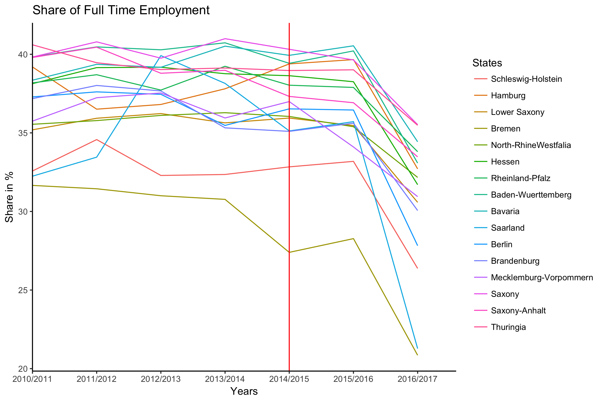

[](http://quantlet.de/)

## [](http://quantlet.de/) **SOEPQ4_EmploymentAnalysis** [](http://quantlet.de/)

```yaml

Name of Quantlet: 	SOEPQ4_EmploymentAnalysis

Published in: 		Employment effects of the new German minimum wage (SOEP dataset)

Description: 		'Generating output of different employment measures. Usage of different regions and employment statuses.'

Keywords: 		plot, graphical representation, distribution, density, panel, empirical

See also: 		SOEPQ1

Authors: 		Meret Borchmann, Jupp Kerschek, Albert Thieme, Timm Walz

Submitted: 		30th of March 2018 by the research team mentioned in "Authors"

Datafile: 		no immediate import data in this quantlet, see SOEPQ1

Input: 			'Usage of merged and filtered dataset generated in SOEPQ'

Output: 		'Graphical visualization of employment variable changes over time'

Example: 		'Time Series of Log Values and Growth Rates of Full Time Employment, Part Time Employment, Marginal Employment'

```


### R Code:
```r
## Quantlet 4 - EmploymentAnalysis Load Packages used in Q4
library(dplyr)
library(ggplot2)
# Execution of Q1 is necessary beforehand!

# Employment Graphs This Quantlet produces output of different employment measures

# We look at people in our dataset that are either full time employed, part time employed, marginal
# employed or not employed.  Data pre-processing for analysis by defining a function
data_selector = function(merged_all) {
    select(filter(merged_all), c(Wave, never.Changing.Person.ID, State.of.Residence, Employment.Status,
        Labor.Force.Status, Actual.Work.Time.Per.Week, Current.Gross.Labor.Income.in.Euro))
}

# Create for dataframe with only variables of interest by using the data_selector function on
# merged_all
Reduced_merged = data_selector(merged_all)

# Adjust Labor Force Variable Sort out people not in working force anymore
adj_labor_force = function(x) {
    table(x$Labor.Force.Status)
    levels(x$Labor.Force.Status)
    x$LaborForce_num = NA
    x$LaborForce_num = as.numeric(x$Labor.Force.Status)
    summary(x$LaborForce_num)
    # Just in case there would be missing values
    x$LaborForce_num[x$LaborForce_num <= 6] = NA
    # Too old -> 4720 NA
    x$LaborForce_num[x$LaborForce_num == 8] = NA
    return(x)
}

# Apply adj_labor_force to the sub2013 dataset
Reduced_merged = adj_labor_force(Reduced_merged)

# Adjust Work Time Variable
set_working_time = function(x) {
    x$Actual.Work.Time.Per.Week[(x$Actual.Work.Time.Per.Week) == -3] = NA
    x$Actual.Work.Time.Per.Week[(x$Actual.Work.Time.Per.Week) == -2] = 0
    x$Actual.Work.Time.Per.Week[(x$Actual.Work.Time.Per.Week) == -1] = NA
    return(x)
}

# Apply the set_working_time function to the 2013 dataset
Reduced_merged = set_working_time(Reduced_merged)

# Adjust Data Income
set_income_2 = function(x) {
    x$Current.Gross.Labor.Income.in.Euro[(x$Current.Gross.Labor.Income.in.Euro) <= -3] = NA
    return(x)
}
# Apply set_income_2 to the dataset used above
Reduced_merged = set_income_2(Reduced_merged)

# Define a function to drop NAs
drop_sub_na = function(x) {
    x[complete.cases(x), ]
}
# Apply drop_sub_na to the reduced_merged dataset
Reduced_merged_noNA = drop_sub_na(Reduced_merged)

# We focus our analysis to three different employment statuses (full time, part time, marginal) and the
# non employeed shows all observations of Employment status for each year
yearly_employment = function(x) {
    x %>% group_by(Wave) %>% summarise(Observations = n(), Full.Employment = length(Employment.Status[as.numeric(Employment.Status) ==
        7]), Part.Employment = length(Employment.Status[as.numeric(Employment.Status) == 8]), Marginal.Employment = length(Employment.Status[as.numeric(Employment.Status) ==
        10]), Not.Employment = length(Employment.Status[as.numeric(Employment.Status) == 15]))
}

# Apply yearly_employment to the reduced_merged dataset without NAs
Employment.yearly = yearly_employment(Reduced_merged_noNA)

# Employment Rates by year and state
yearly_employment_state = function(x) {
    x %>% group_by(State.of.Residence, Wave) %>% summarise(Observations = n(), Full.Employment = length(Employment.Status[as.numeric(Employment.Status) ==
        7]), Part.Employment = length(Employment.Status[as.numeric(Employment.Status) == 8]), Marginal.Employment = length(Employment.Status[as.numeric(Employment.Status) ==
        10]), Not.Employment = length(Employment.Status[as.numeric(Employment.Status) == 15]))
}

# Apply yearly_employment_state to the dataset used above
Employment.yearly.state = yearly_employment_state(Reduced_merged)

# Generate different employment measures, Log Employment and % change of Log Employment and Employment
# Rates 1. Log Values of full/part/marginal/not employment 2. % change of log full/part/marginal/not
# employment 3. Employment Rate of full/part/marginal/not employment in % 4. Log Employment Rate of
# full/part/marginal/not employment
calc_employment_variables = function(input, type) {
    if (type == "Full") {
        input$v1 = log(input$Full.Employment)
        input$v2 = c(0, diff(input$v1))
        input$v3 = (input$Full.Employment/input$Observations) * 100
        input$v4 = log(input$v3)
        colnames(input)[colnames(input) == "v1"] = "Log.Full.Employment"
        colnames(input)[colnames(input) == "v2"] = "Delta.Log.Full.Employment"
        colnames(input)[colnames(input) == "v3"] = "Full.Employment.Rate"
        colnames(input)[colnames(input) == "v4"] = "Log.Full.Employment.Rate"
    } else if (type == "Part") {
        input$v1 = log(input$Part.Employment)
        input$v2 = c(0, diff(input$v1))
        input$v3 = (input$Part.Employment/input$Observations) * 100
        input$v4 = log(input$v3)
        colnames(input)[colnames(input) == "v1"] = "Log.Part.Employment"
        colnames(input)[colnames(input) == "v2"] = "Delta.Log.Part.Employment"
        colnames(input)[colnames(input) == "v3"] = "Part.Employment.Rate"
        colnames(input)[colnames(input) == "v4"] = "Log.Part.Employment.Rate"
    } else if (type == "Marginal") {
        input$v1 = log(input$Marginal.Employment)
        input$v2 = c(0, diff(input$v1))
        input$v3 = (input$Marginal.Employment/input$Observations) * 100
        input$v4 = log(input$v3)
        colnames(input)[colnames(input) == "v1"] = "Log.Marginal.Employment"
        colnames(input)[colnames(input) == "v2"] = "Delta.Log.Marginal.Employment"
        colnames(input)[colnames(input) == "v3"] = "Marginal.Employment.Rate"
        colnames(input)[colnames(input) == "v4"] = "Log.Marginal.Employment.Rate"
    } else if (type == "Not") {
        input$v1 = log(input$Not.Employment)
        input$v2 = c(0, diff(input$v1))
        input$v3 = (input$Not.Employment/input$Observations) * 100
        input$v4 = log(input$v3)
        colnames(input)[colnames(input) == "v1"] = "Log.Not.Employment"
        colnames(input)[colnames(input) == "v2"] = "Delta.Log.Not.Employment"
        colnames(input)[colnames(input) == "v3"] = "Not.Employment.Rate"
        colnames(input)[colnames(input) == "v4"] = "Log.Not.Employment.Rate"
    } else {
        print("Error! Input must either be Full, Part, Marginal or Not")
    }
    return(input)
}

# Apply the calc_employment_variables function to Employment.yearly and .state dataset, using different
# employment types
Employment.yearly = calc_employment_variables(Employment.yearly, "Full")
Employment.yearly = calc_employment_variables(Employment.yearly, "Part")
Employment.yearly = calc_employment_variables(Employment.yearly, "Marginal")
Employment.yearly = calc_employment_variables(Employment.yearly, "Not")
Employment.yearly.state = calc_employment_variables(Employment.yearly.state, "Full")
Employment.yearly.state = calc_employment_variables(Employment.yearly.state, "Part")
Employment.yearly.state = calc_employment_variables(Employment.yearly.state, "Marginal")
Employment.yearly.state = calc_employment_variables(Employment.yearly.state, "Not")

# Create Function to set periods for the years in list_years (+1 each)
create_periods = function(list_years) {
    list_years_up = as.numeric(list_years) + 1
    list = paste(list_years, list_years_up, sep = "/")
    return(list)
}

# Apply create_periods to both objects used above
Employment.yearly$Period = create_periods(list_years)
Employment.yearly.state$Period = create_periods(list_years)

# Output Graphs by year illustrate Log Employment of all three groups
plot_graphs_year = function(input, mode, title, y) {
    if (mode == "Log") {
        v1 = input$Log.Full.Employment
        v2 = input$Log.Part.Employment
        v3 = input$Log.Marginal.Employment
        v4 = input$Log.Not.Employment
    } else if (mode == "ChangeLog") {
        v1 = input$Delta.Log.Full.Employment
        v2 = input$Delta.Log.Part.Employment
        v3 = input$Delta.Log.Marginal.Employment
        v4 = input$Delta.Log.Not.Employment
    } else if (mode == "EmployRates") {
        v1 = input$Full.Employment.Rate
        v2 = input$Part.Employment.Rate
        v3 = input$Marginal.Employment.Rate
        v4 = input$Not.Employment.Rate
    } else if (mode == "LogEmployRates") {
        v1 = input$Log.Full.Employment.Rate
        v2 = input$Log.Part.Employment.Rate
        v3 = input$Log.Marginal.Employment.Rate
        v4 = input$Log.Not.Employment.Rate
    } else {
        print("Input must be either Log, ChangeLog, EmployRates or LogEmployRates")
    }
    ggplot(data = input, aes(x = Period, group = 1)) + geom_line(aes(y = v1, color = "Full Time")) + geom_line(aes(y = v2,
        color = "Part Time")) + geom_line(aes(y = v3, color = "Marginal")) + geom_line(aes(y = v4, color = "None")) +
        theme_classic() + labs(title = title, y = y, x = "Years") + scale_colour_hue(name = "Employment Status") +
        geom_vline(xintercept = 5, color = "red")
}

# Apply plot_graphs_year to Employment.yearly using different mode
# Illustrate Log Employment of all three groups
plot_graphs_year(Employment.yearly, "Log", "Log Employment over Time", "Log Employment")
```

```r
plot_graphs_year_log = plot_graphs_year(Employment.yearly, "Log", "Log Employment over Time", "Log Employment")
# ggsave('SOEPQ4_EmploymentAnalysis/plots/plot_graphs_year_log.png', plot_graphs_year_log)

# Illustrate % change of Log Employment of all three groups
plot_graphs_year(Employment.yearly, "ChangeLog", "Growth Rate of Employment over Time", "Growth rate change in %")
```

```r
plot_graphs_year_changelog = plot_graphs_year(Employment.yearly, "ChangeLog", "Growth Rate of Employment over Time",
    "Growth rate change in %")
# ggsave('SOEPQ4_EmploymentAnalysis/plots/plot_graphs_year_changelog.png', plot_graphs_year_changelog)

# Illustrate Emplyoment Rates of all three groups
plot_graphs_year(Employment.yearly, "EmployRates", "Employment Rate over Time", "Employment rate in %")
```

```r
plot_graphs_year_employrates = plot_graphs_year(Employment.yearly, "EmployRates", "Employment Rate over Time",
    "Employment rate in %")
# ggsave('SOEPQ4_EmploymentAnalysis/plots/plot_graphs_year_employrates.png', plot_graphs_year_employrates)

# Illustrate Log Employment Rates of all three groups
plot_graphs_year(Employment.yearly, "LogEmployRates", "LogEmployment Rate over Time", "Log Employment rate in %")
```

```r
plot_graphs_year_logemployrates = plot_graphs_year(Employment.yearly, "LogEmployRates", "LogEmployment Rate over Time",
    "Log Employment rate in %")
# ggsave('SOEPQ4_EmploymentAnalysis/plots/plot_graphs_year_logemployrates.png', plot_graphs_year_logemployrates)

# OUTPUT Graphs for each state of the employment variables over time
# Define a function with different employment modes
plot_graphs_share = function(input, mode, title) {
  if (mode == "Full") {
    v1 = input$Full.Employment.Rate
  } else if (mode == "Part") {
    v1 = input$Part.Employment.Rate
  } else if (mode == "Marginal") {
    v1 = input$Marginal.Employment.Rate
  } else if (mode == "Not") {
    v1 = input$Not.Employment.Rate
  }
  ggplot(data = input, aes(x = Period, group = State.of.Residence, color = State.of.Residence)) + geom_line(aes(y = v1)) +
    theme_classic() + labs(title = title, y = "Share in %", x = "Years") + geom_vline(xintercept = 5,
                                                                                            color = "red") + coord_cartesian(xlim = c(1.6, 7)) + scale_colour_hue(name = "States", labels = c("Schleswig-Holstein",
                                                                                                                                                                                              "Hamburg", "Lower Saxony", "Bremen", "North-RhineWestfalia", "Hessen", "Rheinland-Pfalz", "Baden-Wuerttemberg",
                                                                                                                                                                                              "Bavaria", "Saarland", "Berlin", "Brandenburg", "Mecklemburg-Vorpommern", "Saxony", "Saxony-Anhalt",
                                                                                                                                                                                              "Thuringia"))
}

# Apply plot_graphs_share to Employment.yearly.state using different employment types
# Full time employment share
plot_graphs_share(Employment.yearly.state, "Full", "Share of Full Time Employment")
```

```r
plot_graphs_share_full = plot_graphs_share(Employment.yearly.state, "Full", "Share of Full Time Employment")
# ggsave('SOEPQ4_EmploymentAnalysis/plots/plot_graphs_share_full.png', plot_graphs_share_full)

# Part time employment share
plot_graphs_share(Employment.yearly.state, "Part", "Share of Part Time Employment")

```

```r
plot_graphs_share_part = plot_graphs_share(Employment.yearly.state, "Part", "Share of Part Time Employment")
# ggsave('SOEPQ4_EmploymentAnalysis/plots/plot_graphs_share_part.png', plot_graphs_share_part)

# Marginal employment share
plot_graphs_share(Employment.yearly.state, "Marginal", "Share of Marginal Employment")
```

```r
plot_graphs_share_marginal = plot_graphs_share(Employment.yearly.state, "Marginal", "Share of Marginal Employment")
# ggsave('SOEPQ4_EmploymentAnalysis/plots/plot_graphs_share_marginal.png', plot_graphs_share_marginal)
# Not employed share
plot_graphs_share(Employment.yearly.state, "Not", "Share of Not Employed")

```

```r
plot_graphs_share_not = plot_graphs_share(Employment.yearly.state, "Not", "Share of Not Employed")
# ggsave('SOEPQ4_EmploymentAnalysis/plots/plot_graphs_share_not.png', plot_graphs_share_not)

```
