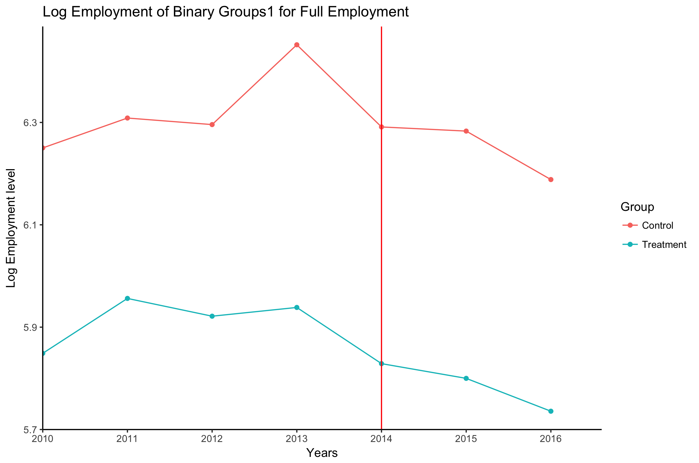
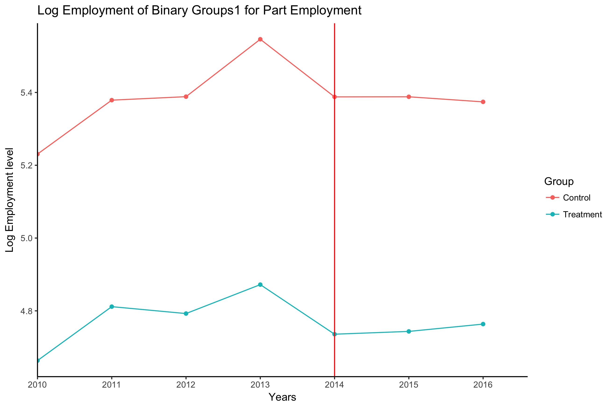
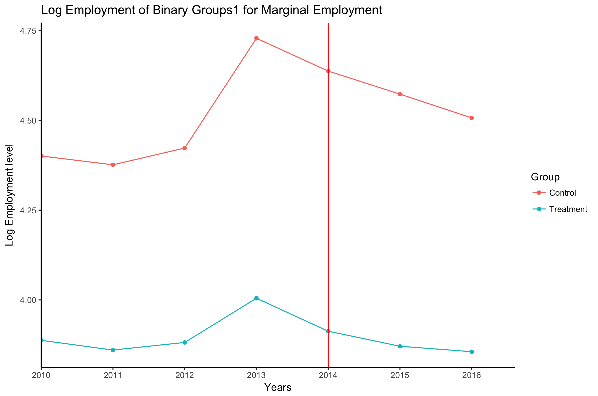
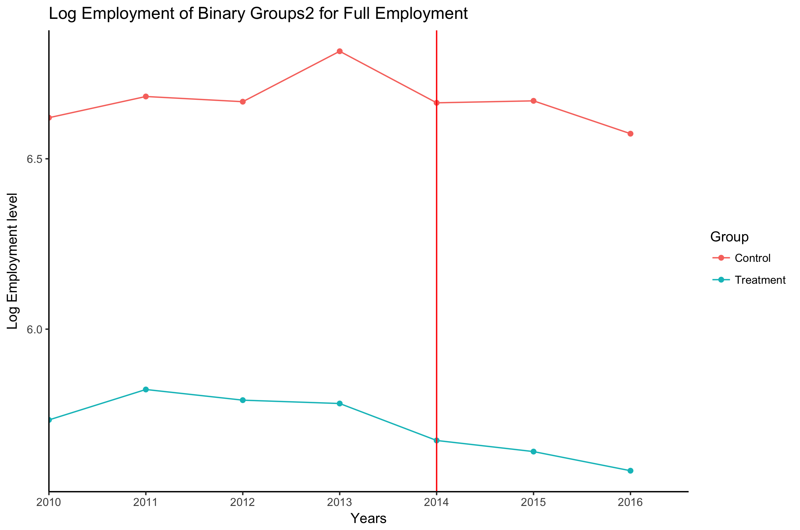
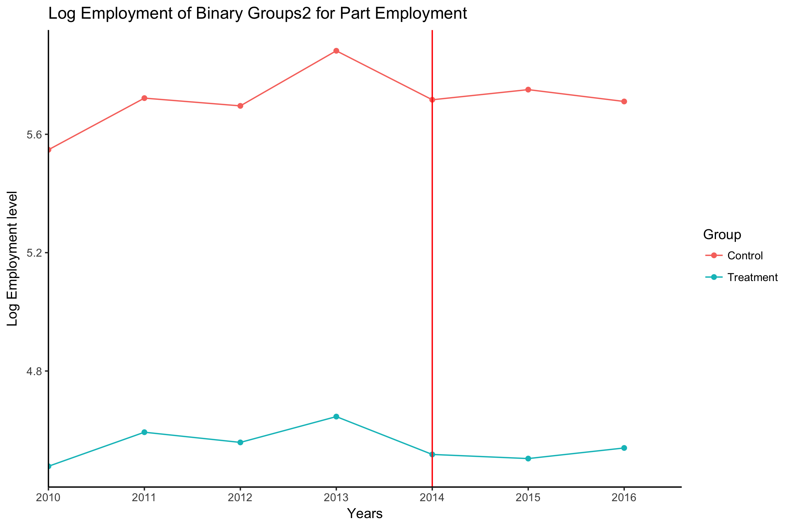
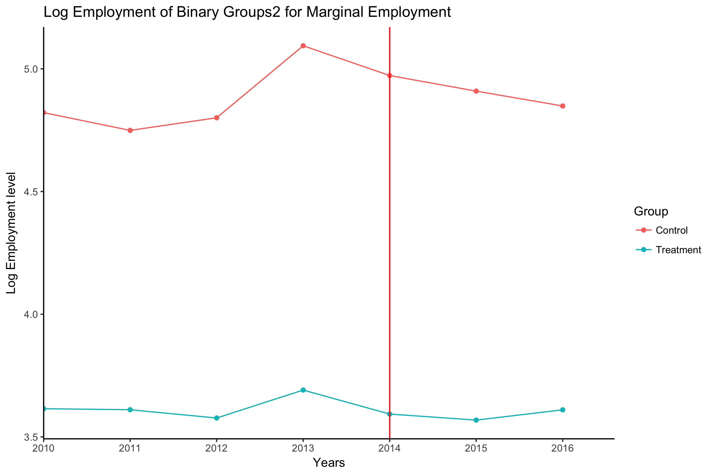
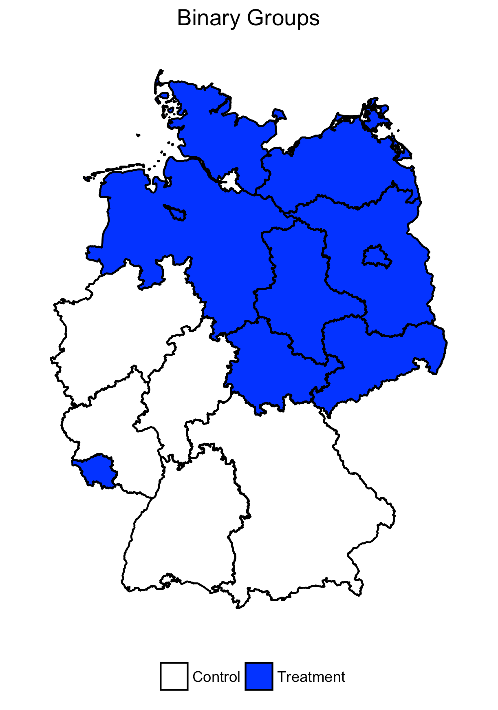
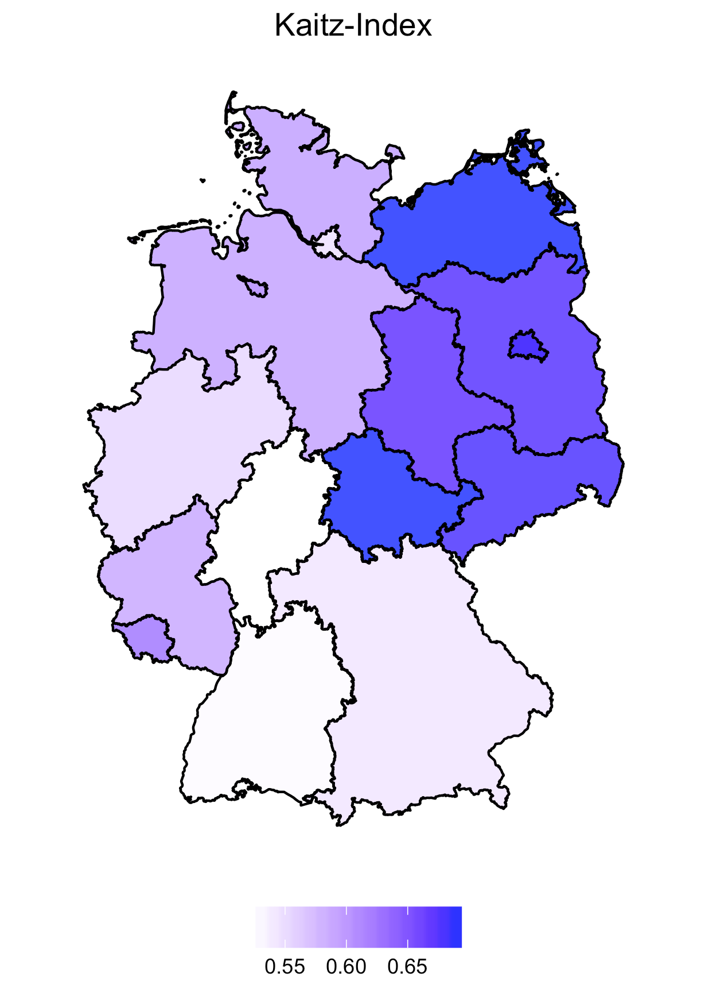

[](http://quantlet.de/)

## [](http://quantlet.de/) **SOEPQ6_GraphicalAnalysisMinWage** [](http://quantlet.de/)

```yaml

Name of Quantlet: 	SOEPQ6_GraphicalAnalysisMinWage

Published in: 		Employment effects of the new German minimum wage (SOEP dataset)

Description: 		'Combining data information about Earnings and Employment to identify German stages
which are more affected to minimum wage introduction.
Computing continous and binary treatment variables.'

Keywords: 		heat-map, empirical, time-series, plot, graphical representation

See also: 		SOEPQ1, SOEPQ4, SOEPQ5

Authors: 		Meret Borchmann, Jupp Kerschek, Albert Thieme, Timm Walz

Submitted: 		30th of March 2018 by the research team mentioned in "Authors"

Datafile: 		geodata/DEU_adm1.rds

Input: 			'Usage of merged and filtered dataset generated in SOEPQ1 and the subdatasets generated in SOEPQ4 and SOEPQ5'

Output:  		'Visualization of treatment assignment across Germany. Time-series of Employment using Treatment and Control Groups'

```

### R Code:
```r
## Quantlet 6 - GraphicalAnalysisMinWage Load Packages used in Q6
library(ggplot2)
library(sp)
# Execution of Q1, Q4 and Q5 is necessary beforehand!

# Combine Information of Q4 and Q5 We use the averaged data from Q4 for the employment rates and add
# the Fraction and Keitz Index from Q5
combine_data = function(x, y) {
    combined = merge(x, y)
    combined = combined %>% group_by(Wave, State.of.Residence) %>% arrange(Wave)
    return(combined)
}

# Apply combine_data to merge, filter, group and arrange Employment.yearly.state and dbys
analyze_tc = combine_data(Employment.yearly.state, dbys)

# Treatment Identification with Keitz Index Use Median of Keitz Index in 2013 for identification
# 1.Standard treatment: If Kaitz higher than Median the State will be treatmant, otherwise control
# 2.Robust treatment: If Kaitz higher than 60% - Percetil will be treatment, if under 40%
data_selector = function(analyze_tc, wave) {
    select(filter(analyze_tc, Wave == wave), c(Wave, State.of.Residence, Kaitz, Fraction))
}

# Create subset for 2013
analyze_2013 = data_selector(analyze_tc, 2013)

add_treatment = function(x) {
    x$binary_treatment1 = NA
    x$binary_treatment1[x$Kaitz > median(x$Kaitz)] = 1
    x$binary_treatment1[is.na(x$binary_treatment1)] = 0
    x$binary_treatment2 = NA
    x$binary_treatment2[x$Kaitz > quantile(x$Kaitz, c(0.6))] = 1
    x$binary_treatment2[x$Kaitz < quantile(x$Kaitz, c(0.4))] = 0
    return(x)
}

# Apply add_treatment with analyze_2013 dataset
analyze_2013 = add_treatment(analyze_2013)

# Set Treatment Identifiers to the same column in the main data
analyze_tc$binary_treatment1 = analyze_2013$binary_treatment1
analyze_tc$binary_treatment2 = analyze_2013$binary_treatment2

# Function to aggregate data into standard Treatment and Control group using binary_treatment1 or
# binary_treatment2, depending on the input
aggregate_treatment_control = function(x, y) {
    if (y == 1) {
        x$y = x$binary_treatment1
    } else if (y == 2) {
        x$y = x$binary_treatment2
    }
    x = x %>% group_by(Wave, y) %>% summarise(Observation = n(), Avg.Log.Full.Employment = mean(Log.Full.Employment,
        na.rm = TRUE), Avg.Log.Part.Employment = mean(Log.Part.Employment, na.rm = TRUE), Avg.Log.Marginal.Employment = mean(Log.Marginal.Employment,
        na.rm = TRUE), Avg.Delta.Log.Full.Employment = mean(Delta.Log.Full.Employment, na.rm = TRUE), Avg.Delta.Log.Part.Employment = mean(Delta.Log.Part.Employment,
        na.rm = TRUE), Avg.Delta.Log.Marginal.Employment = mean(Delta.Log.Marginal.Employment, na.rm = TRUE),
        Avg.Full.Employment.Rate = mean(Full.Employment.Rate, na.rm = TRUE), Avg.Part.Employment.Rate = mean(Part.Employment.Rate,
            na.rm = TRUE), Avg.Marginal.Employment.Rate = mean(Marginal.Employment.Rate, na.rm = TRUE))
    if (y == 1) {
        x$binary_treatment1 = x$y
    } else if (y == 2) {
        x$binary_treatment2 = x$y
    } else {
        print("Only 1 and 2 are valid as values for y!")
    }
    x$y = NULL
    return(x)
}

# Apply aggregate_standard_treatment_control to analyze_tc either with binary_treatment11 or
# binary_treatment12
Treatment.analysis1 = aggregate_treatment_control(analyze_tc, 1)
Treatment.analysis2 = aggregate_treatment_control(analyze_tc, 2)

# Define function to delete all rows with missing values, so that only complete datasets remain
drop_sub_na = function(x) {
    x[complete.cases(x), ]
}
# Apply drop_sub_na to Treatment.analysis2 to drop lines with missing values
Treatment.analysis2_noNA = drop_sub_na(Treatment.analysis2)

# GRAPHS # Function to plot log employment of binary treatmentgroup for different employment status
plot_treatment = function(x, yaxis, treatment, title) {
    if (yaxis == "Full") {
        x$yaxis = x$Avg.Log.Full.Employment
    } else if (yaxis == "Part") {
        x$yaxis = x$Avg.Log.Part.Employment
    } else if (yaxis == "Marginal") {
        x$yaxis = x$Avg.Log.Marginal.Employment
    } else {
        print("Input must be Full, Part or Marginal!")
    }
    if (treatment == 1) {
        x$treatment = x$binary_treatment1
    } else if (treatment == 2) {
        x$treatment = x$binary_treatment2
    } else {
        print("Input must be 1 or 2!")
    }
    ggplot(data = na.omit(x), aes(x = Wave, y = yaxis, group = factor(treatment), colour = factor(treatment)),
        na.rm = TRUE) + geom_line() + geom_point() + labs(title = title, y = "Log Employment level", x = "Years") +
        geom_vline(xintercept = 5, color = "red") + theme_classic() + scale_colour_discrete(name = "Group",
        labels = c("Control", "Treatment")) + coord_cartesian(xlim = c(1.6, 7))
}

# Apply the function to different treatment analysis datasets For Full Time Employment
# T1
plot_treatment(Treatment.analysis1, "Full", 1, "Log Employment of Binary Groups1 for Full Employment")
```

```r
plot_treatment_t1full = plot_treatment(Treatment.analysis1, "Full", 1, "Log Employment of Binary Groups1 for Full Employment")
# ggsave('SOEPQ6_GraphicalAnalysisMinWage/plots/plot_treatment_t1full.png', plot_treatment_t1full)
# For Part Time Employment, T1
plot_treatment(Treatment.analysis1, "Part", 1, "Log Employment of Binary Groups1 for Part Employment")
```

```r
plot_treatment_t1part = plot_treatment(Treatment.analysis1, "Part", 1, "Log Employment of Binary Groups1 for Part Employment")
# ggsave('SOEPQ6_GraphicalAnalysisMinWage/plots/plot_treatment_t1part.png', plot_treatment_t1part)
# For Marginal Time Employment, T1
plot_treatment(Treatment.analysis1, "Marginal", 1, "Log Employment of Binary Groups1 for Marginal Employment")
```

```r
plot_treatment_ta1marginal = plot_treatment(Treatment.analysis1, "Marginal", 1, "Log Employment of Binary Groups1 for Marginal Employment")
# ggsave('SOEPQ6_GraphicalAnalysisMinWage/plots/plot_treatment_ta1marginal.png', plot_treatment_ta1marginal)
# For Full Time Employment, T2
plot_treatment(Treatment.analysis2, "Full", 2, "Log Employment of Binary Groups2 for Full Employment")
```

```r
plot_treatment_ta2full = plot_treatment(Treatment.analysis2, "Full", 2, "Log Employment of Binary Groups2 for Full Employment")
# ggsave('SOEPQ6_GraphicalAnalysisMinWage/plots/plot_treatment_ta2full.png', plot_treatment_ta2full)
# For Part Time Employment, T2
plot_treatment(Treatment.analysis2, "Part", 2, "Log Employment of Binary Groups2 for Part Employment")
```

```r
plot_treatment_ta2part = plot_treatment(Treatment.analysis2, "Part", 2, "Log Employment of Binary Groups2 for Part Employment")
# ggsave('SOEPQ6_GraphicalAnalysisMinWage/plots/plot_treatment_ta2part.png', plot_treatment_ta2part)
# For Marginal Time Employment, T2
plot_treatment(Treatment.analysis2, "Marginal", 2, "Log Employment of Binary Groups2 for Marginal Employment")
```

```r
plot_treatment_ta2marginal = plot_treatment(Treatment.analysis2, "Marginal", 2, "Log Employment of Binary Groups2 for Marginal Employment")
# ggsave('SOEPQ6_GraphicalAnalysisMinWage/plots/plot_treatment_ta2marginal.png', plot_treatment_ta2marginal)

# MAP PLOTS to illustrate Kaitz, Fraction and Treatment for the German states Read Map File for Germany
map = readRDS("SOEPQ6_GraphicalAnalysisMinWage/geodata/DEU_adm1.rds")

# Unify the States
substituteState = function(x) {
    x = as.character(x)
    x = gsub("16", "Thüringen", x)
    x = gsub("15", "Sachsen-Anhalt", x)
    x = gsub("14", "Sachsen", x)
    x = gsub("13", "Mecklenburg-Vorpommern", x)
    x = gsub("12", "Brandenburg", x)
    x = gsub("11", "Berlin", x)
    x = gsub("10", "Saarland", x)
    x = gsub("9", "Bayern", x)
    x = gsub("8", "Baden-Württemberg", x)
    x = gsub("7", "Rheinland-Pfalz", x)
    x = gsub("6", "Hessen", x)
    x = gsub("5", "Nordrhein-Westfalen", x)
    x = gsub("4", "Bremen", x)
    x = gsub("3", "Niedersachsen", x)
    x = gsub("2", "Hamburg", x)
    x = gsub("1", "Schleswig-Holstein", x)
}

# Apply the substituteState-Function to plot it properly
analyze_2013$State.of.Residence = substituteState(analyze_2013$State.of.Residence)

# Correct and Order the State Names, so that the names are distinct
correctState = function(x) {
    # Order it alphabetically, ascending
    x = x[order(x$State.of.Residence), ]
    # Define the Treatment as Factor
    x$binary_treatment1 = as.factor(x$binary_treatment1)
    # List with all State Names
    x$State.of.Residence = c("Baden-Württemberg", "Bayern", "Berlin", "Brandenburg", "Bremen", "Hamburg",
        "Hessen", "Mecklenburg-Vorpommern", "Niedersachsen", "Nordrhein-Westfalen", "Rheinland-Pfalz",
        "Saarland", "Sachsen-Anhalt", "Sachsen", "Schleswig-Holstein", "Thüringen")
    return(x)
}

# Apply the correctState to the analyze_2013 dataset
analyze_2013 = correctState(analyze_2013)

# Function to create map data which can be proceeded with ggplot
createMapdata = function(input_map, input) {
    data_combined = data_frame(id = rownames(input_map@data), State.of.Residence = input_map@data$NAME_1) %>%
        left_join(input, by = "State.of.Residence")
    map2 = fortify(input_map)
    final_map = left_join(map2, data_combined, by = "id")
}

# Apply the imported polygon map and the dataset createMapdata to create a valid plot dataset
final_map = createMapdata(map, analyze_2013)

# PLOT Functions Function to plot the Kaitz or Fraction Index. The dataset created with createMapdata
# has to be used for this
plot_result_index = function(input, mode, highcolor) {
    if (mode == "Fraction") {
        input$mode = input$Fraction
    } else if (mode == "Kaitz") {
        input$mode = input$Kaitz
    } else {
        print("Input must be Fraction or Kaitz!")
    }
    ggplot(input, aes(x = long, y = lat, group = group)) + geom_polygon(data = input, aes(fill = mode),
        alpha = 0.8, color = "black") + scale_fill_gradient(low = "white", high = highcolor) + coord_map() +
        theme(legend.position = "bottom", panel.grid.major = element_blank(), panel.grid.minor = element_blank(),
            panel.background = element_blank(), axis.line = element_blank(), axis.text.x = element_blank(),
            axis.text.y = element_blank(), axis.ticks = element_blank(), axis.title.x = element_blank(),
            axis.title.y = element_blank(), plot.title = element_text(hjust = 0.5), legend.title = element_blank()) +
        labs(title = paste(mode, "Index", sep = "-"))
}

# Function to plot the Factors. The dataset created with createMapdata has to be used for this
plot_result_factor = function(x) {
    Treatment = factor(x$binary_treatment1)
    ggplot(x) + aes(x = long, y = lat, group = group, fill = Treatment) + geom_polygon(color = "black") +
        coord_map() + scale_fill_manual(values = c("white", "blue"), labels = c("Control", "Treatment")) +
        geom_path(color = "black") + theme(legend.position = "bottom", panel.grid.major = element_blank(),
        panel.grid.minor = element_blank(), panel.background = element_blank(), axis.line = element_blank(),
        axis.text.x = element_blank(), axis.text.y = element_blank(), axis.ticks = element_blank(), axis.title.x = element_blank(),
        axis.title.y = element_blank(), plot.title = element_text(hjust = 0.5), axis.ticks.length = unit(0,
            "mm"), legend.title = element_blank()) + labs(title = "Binary Groups")
}

# Apply Plot Functions Plot Binary Treatment Variable
plot_result_factor(final_map)
```

```r
plot_result_binary = plot_result_factor(final_map)
# ggsave('SOEPQ6_GraphicalAnalysisMinWage/plots/plot-factor.png', plot_result_binary) Plot Kaitz Index
plot_result_index(final_map, "Kaitz", "blue")
```

```r
plot_result_kaitz = plot_result_index(final_map, "Kaitz", "blue")
# ggsave('SOEPQ6_GraphicalAnalysisMinWage/plots/plot-kaitz.png', plot_result_kaitz) Plot Fraction Index
plot_result_index(final_map, "Fraction", "red")
```

```r
plot_result_fraction = plot_result_index(final_map, "Fraction", "red")
# ggsave('SOEPQ6_GraphicalAnalysisMinWage/plots/plot-fraction.png', plot_result_fraction)

```
